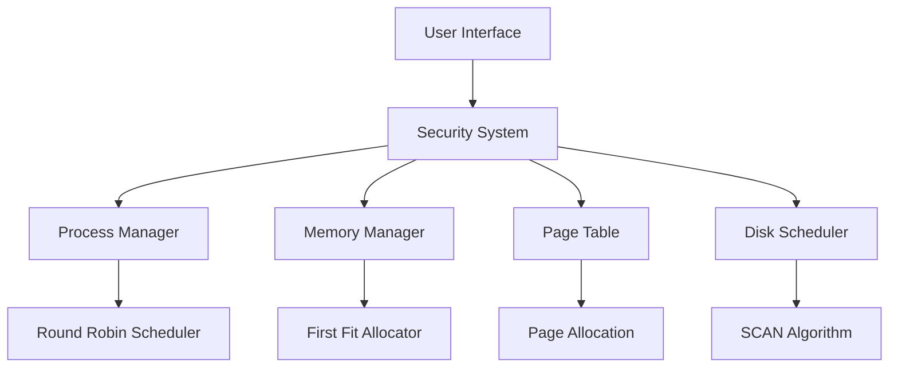
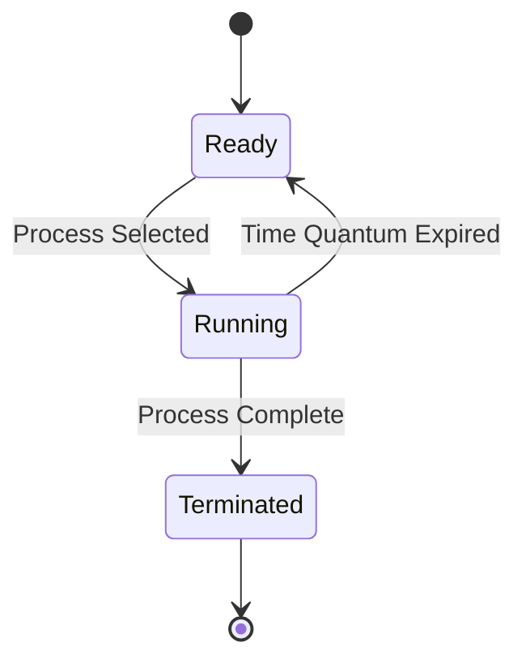
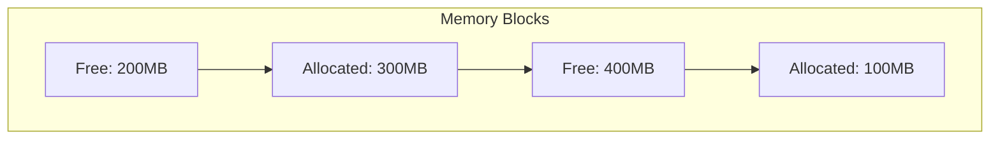
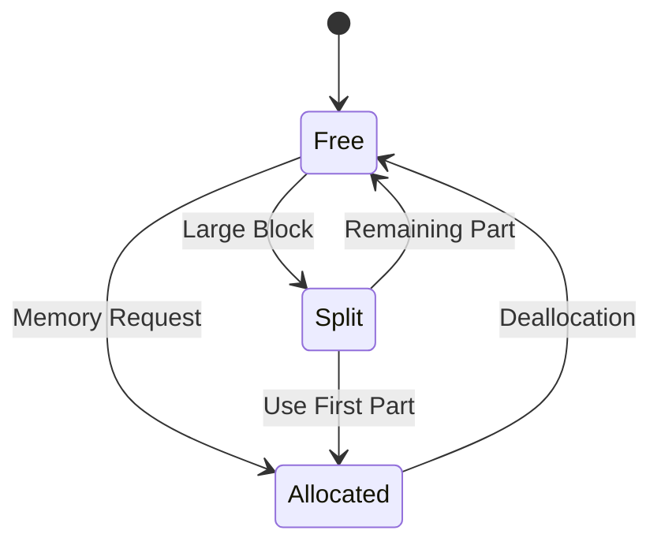
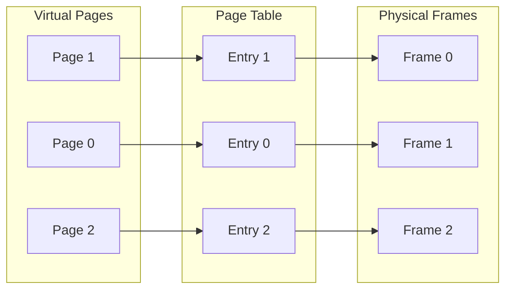
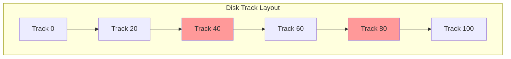
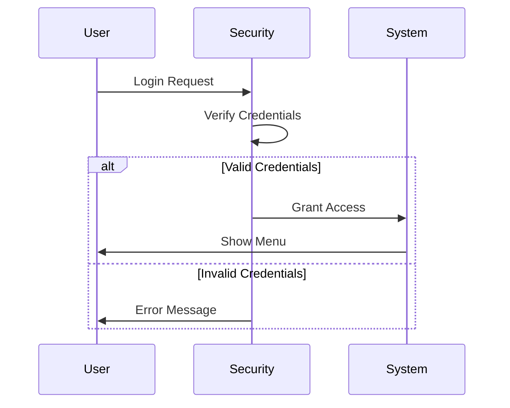
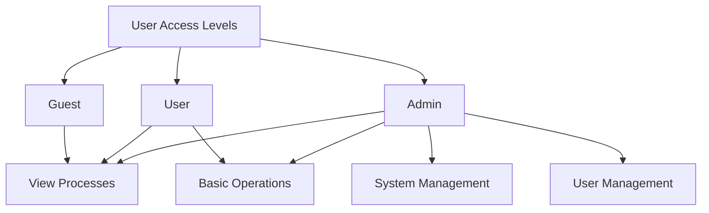

# Operating-System-Project

# Operating System Simulation Project
## Comprehensive Documentation & Algorithm Guide

## Table of Contents
1. Project Overview
2. Process Management & Scheduling
3. Memory Management
4. Page Table Management
5. Disk Scheduling
6. Security System

---

## 1. Project Overview

### Project Description
This C++ based Operating System simulation implements core OS concepts including:
- Process scheduling
- Memory allocation and management
- Page table operations
- Disk scheduling
- Security and authentication

### System Architecture


---

## 2. Process Management & Scheduling

### Round Robin Scheduling Algorithm

#### Concept
Round Robin is a preemptive scheduling algorithm that assigns a fixed time quantum to each process in a circular queue.

#### Visual Representation


#### How It Works
1. Time Quantum: 2 units
2. Process States:
   - Ready: Waiting for CPU
   - Running: Currently executing
   - Terminated: Execution complete

#### Example Scenario

```mermaid
gantt
    title Round Robin Scheduling (Time Quantum = 2)
    dateFormat X
    axisFormat %s

    section Process 1
    CPU Burst :0, 2
    Waiting   :2, 4
    CPU Burst :4, 5

    section Process 2
    Waiting   :0, 2
    CPU Burst :2, 4
    CPU Burst :5, 6

    section Process 3
    Waiting   :0, 4
    CPU Burst :4, 5
    CPU Burst :6, 7
```


#### Implementation Highlights
```cpp
void executeRoundRobin() {
    while (!readyQueue.empty()) {
        Process current = readyQueue.front();
        readyQueue.pop();
        
        // Execute for time quantum
        int executeTime = min(timeQuantum, current.remainingTime);
        current.remainingTime -= executeTime;
        
        // Requeue if not complete
        if (current.remainingTime > 0) {
            readyQueue.push(current);
        }
    }
}
```

---

## 3. Memory Management

### First Fit Memory Allocation

#### Concept
First Fit searches from the beginning of memory and allocates the first block that's large enough to accommodate the request.

#### Visual Representation


#### Memory Block States


#### Memory Map Example
```
=== Memory Map ===
Start    Size     Status     Process
0        200MB    Free       N/A
200      300MB    Allocated  Process1
500      400MB    Free       N/A
900      100MB    Allocated  Process2
```

#### Implementation Highlights
```cpp
int allocateMemory(int size, string processName) {
    for (auto& block : memoryBlocks) {
        if (!block.allocated && block.size >= size) {
            // Split if necessary
            if (block.size > size) {
                splitBlock(block, size);
            }
            block.allocated = true;
            block.processName = processName;
            return block.start;
        }
    }
    return -1;
}
```

---

## 4. Page Table Management

### Virtual Memory Paging

#### Concept
Maps virtual page numbers to physical frame numbers, managing memory access and protection.

#### Visual Representation


#### Page Table Entry Structure
```cpp
struct PageTableEntry {
    int frameNumber;  // Physical frame number
    bool valid;       // Is page in memory?
    bool dirty;       // Has page been modified?
    bool referenced;  // Has page been accessed?
};
```

#### Implementation Example
```cpp
bool allocatePage(int pageNumber) {
    if (freeFrames.empty()) return false;
    
    int frame = freeFrames.back();
    freeFrames.pop_back();
    
    pageTable[pageNumber] = {
        frame,  // frameNumber
        true,   // valid
        false,  // dirty
        false   // referenced
    };
    return true;
}
```

---

## 5. Disk Scheduling

### SCAN (Elevator) Algorithm

#### Concept
The disk head moves in one direction servicing requests until it reaches the end, then reverses direction.

#### Visual Representation


#### Head Movement Example
```mermaid
xychart-beta
    title "Disk Head Movement (SCAN)"
    x-axis [0, 20, 40, 60, 80, 100]
    y-axis "Time" 0 --> 5
    line [50, 65, 80, 95, 80, 60, 45, 30]
```

#### Implementation Highlights
```cpp
vector<int> executeSCAN(bool direction = true) {
    vector<int> sequence;
    vector<int> greater, lesser;
    
    // Sort requests by location
    for (int pos : requests) {
        if (pos >= currentPosition)
            greater.push_back(pos);
        else
            lesser.push_back(pos);
    }
    
    // Build sequence based on direction
    if (direction) {
        sequence = greater + reverse(lesser);
    } else {
        sequence = reverse(lesser) + greater;
    }
    return sequence;
}
```

---

## 6. Security System

### Role-Based Access Control

#### Authentication Flow


#### Access Levels


#### Implementation Example
```cpp
struct User {
    string username;
    string password;
    UserRole role;
};

bool authenticate(string username, string password) {
    for (User& user : users) {
        if (user.username == username && 
            user.password == password) {
            currentUser = &user;
            return true;
        }
    }
    return false;
}
```

This comprehensive documentation covers all major algorithms and concepts implemented in the project. Each section includes:
- Theoretical explanation
- Visual representation
- Implementation details
- Example scenarios

Read this and enjoy the project.
</antArtifact>
